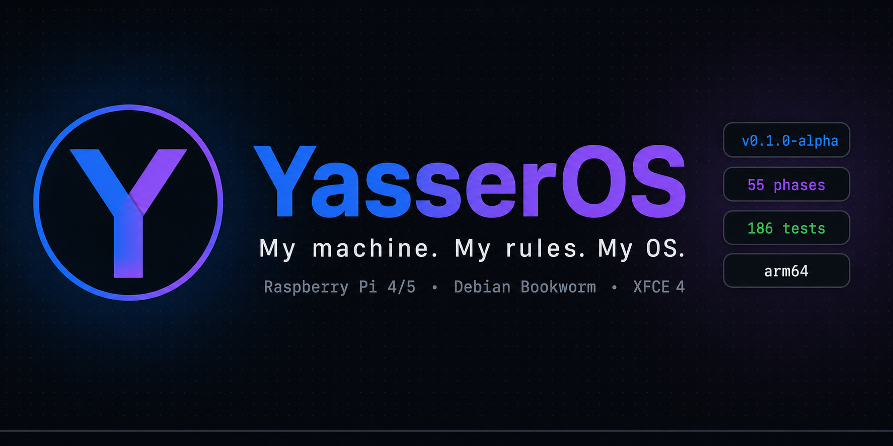
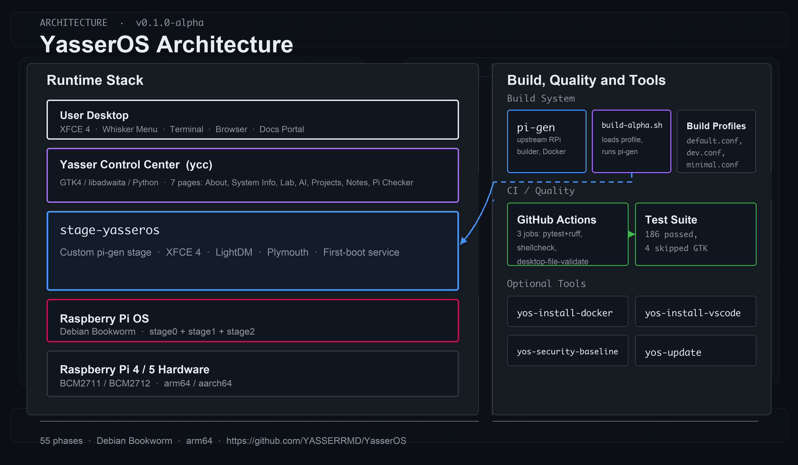

# YasserOS



A personal hobby operating system built on Raspberry Pi OS (Debian bookworm).

> **Hobby Project Disclaimer:** YasserOS is a personal brand experiment and learning project. It is not a production operating system, not a commercial product, and not intended for use by anyone other than its creator. It is not affiliated with the Raspberry Pi Foundation or Debian. Use at your own risk.

## Personal Brand

YasserOS is part of the **MY** (Mohamed Yasser) personal brand — a portfolio of engineering projects built to learn, experiment, and create. The "OS" in YasserOS is both literal (it's an actual operating system) and philosophical (it's a system for doing things *my* way).

*Tagline: "My machine. My rules. My OS."*

## Vision

YasserOS is a custom Linux distribution for Raspberry Pi 4, built from [Raspberry Pi OS](https://www.raspberrypi.com/software/) (Debian bookworm) using [pi-gen](https://github.com/RPi-Distro/pi-gen).

It exists to:
- **Learn** how Linux distributions are built from scratch using real build tools
- **Experiment** with custom desktops, boot experiences, and system tools
- **Build** a portfolio project demonstrating deep systems-level engineering
- **Create** something genuinely useful as a personal daily-driver OS

The first 20 phases establish the foundation: understanding pi-gen, building an unmodified Raspberry Pi OS image, adding a branded customisation layer, and shipping the first bootable YasserOS alpha.

## Goals

**v0.1.0-alpha Goals (Phases 1–55):**
- [x] Fork and understand pi-gen
- [x] Build a branded YasserOS image with `stage-yasseros`
- [x] CI/CD via GitHub Actions (pytest + shellcheck + desktop-file-validate)
- [x] Yasser Control Center — 7-page GTK4/libadwaita app
- [x] Local documentation portal, browser homepage, terminal branding
- [x] First-boot systemd service, security baseline, optional tools
- [x] Build profiles (default/dev/minimal), image validation script
- [x] 186 automated tests (4 skipped — GTK requires display)

## Architecture



**Build System:** [pi-gen](https://github.com/RPi-Distro/pi-gen) (ARM images) + debian-live-build (amd64 testing)  
**Target Hardware:** Raspberry Pi 4 (BCM2711, ARMv8 64-bit)  
**Base OS:** Debian bookworm (via Raspberry Pi OS)  
**Desktop:** XFCE 4.x + LightDM  

See [ADR-001](docs/adr/ADR-001-build-system-choice.md) for the build system decision rationale.

## Build Prerequisites

**Recommended: Docker (any OS)**
- Docker Engine 20.10+
- 4+ CPU cores, 8 GB RAM, 50 GB free disk
- Internet access (for apt package downloads)

**Alternative: Native Debian/Ubuntu host**
- Debian 12 or Ubuntu 22.04/24.04
- `sudo` access
- Required packages: `debootstrap qemu-user-static parted dosfstools`

See [docs/build-host-requirements.md](docs/build-host-requirements.md) for full requirements.

## Quick Start

```bash
# 1. Clone with submodules
git clone --recurse-submodules https://github.com/YASSERRMD/YasserOS.git
cd YasserOS

# 2. Check your build environment
./scripts/check-build-env.sh

# 3. Build YasserOS image
./scripts/build-yasseros.sh

# 4. Flash to SD card (replace /dev/sdX with your card)
xz -dc deploy/YasserOS-*.img.xz | sudo dd of=/dev/sdX bs=4M status=progress

# 5. Boot on Raspberry Pi 4 and enjoy
```

> **Note:** The build scripts are added in Phase 5. If scripts are missing, see [pi-gen's own README](pi-gen/README.md) for manual build instructions.

## Roadmap

| Phase Range | Focus                                           | Status      |
|------------|--------------------------------------------------|-------------|
| 1–7        | Foundation: pi-gen, first vanilla build          | ✅ Complete |
| 8–13       | Identity: branding, boot splash, Plymouth        | ✅ Complete |
| 14–20      | Desktop + Control Center skeleton                | ✅ Complete |
| 21–28      | Control Center pages: AI, Projects, Notes, Pi Checker, Menu | ✅ Complete |
| 29–35      | XFCE panel, terminal, docs portal, browser, tools | ✅ Complete |
| 36–42      | Performance, security, first-boot, build system, CI | ✅ Complete |
| 43–49      | Quality, QA, VirtualBox, shared layer, visual polish | ✅ Complete |
| 50–55      | Alpha release preparation and tagging            | ✅ Complete |

## Credits

**Created by:** YASSERRMD (Mohamed Yasser)

**Tools and inspirations:**
- [pi-gen](https://github.com/RPi-Distro/pi-gen) by the Raspberry Pi Foundation — the build system this project is entirely based on
- [Raspberry Pi OS](https://www.raspberrypi.com/software/) — the upstream OS
- [Debian](https://www.debian.org/) — the foundation everything is built on
- [XFCE](https://www.xfce.org/) — the chosen desktop environment

## Upstream Attribution

This project is a downstream customisation of **Raspberry Pi OS**, built using **pi-gen** by the Raspberry Pi Foundation.

- Upstream pi-gen repository: https://github.com/RPi-Distro/pi-gen
- pi-gen license: BSD 3-Clause (see [pi-gen/LICENSE](pi-gen/LICENSE))
- Raspberry Pi OS copyright: Raspberry Pi (Trading) Ltd.

YasserOS complies with the pi-gen BSD 3-Clause license terms. The Raspberry Pi name and logo are trademarks of Raspberry Pi Ltd. YasserOS is not endorsed by or affiliated with Raspberry Pi Ltd.

## License

YasserOS is licensed under the **BSD 3-Clause License** — the same license as pi-gen.

See [LICENSE](LICENSE) for the full license text.

Custom assets (wallpapers, logos) in `assets/` are original work by YASSERRMD — All Rights Reserved for personal use.

## Screenshots

| Boot Splash | Desktop | Yasser Control Center |
|------------|---------|----------------------|
| *(post-flash)* | *(post-flash)* | *(post-flash)* |

## FAQ

**Q: Is this actually usable?**  
A: After Phase 20, yes — on a Raspberry Pi 4. It's a real Linux OS, just a personal one.

**Q: Can I use this?**  
A: Technically yes (BSD 3-Clause license), but it's not designed for general use. You'd be better off with standard Raspberry Pi OS.

**Q: Why not just use Raspberry Pi OS?**  
A: Because building your own OS is how you deeply understand how it works.

**Q: Why pi-gen and not Yocto/Buildroot?**  
A: pi-gen builds on Debian, giving access to ~60,000 apt packages. See [ADR-001](docs/adr/ADR-001-build-system-choice.md).

**Q: Does this run on Raspberry Pi 5?**  
A: Should work on Pi 5 (same ARM64 architecture), but primary testing is on Pi 4.

## Known Limitations

- **Build time:** 20–60 minutes per image on a modern PC
- **ARM only (Phase 1–20):** pi-gen produces ARM images only; amd64 VirtualBox track is for development testing
- **No automated testing:** Image validation is manual (Phase 7 checklists)
- **No OTA updates:** Updating YasserOS requires reflashing the SD card
- **Single user:** Only the `yasser` user account is configured by default
- **English only:** Locale is en_GB.UTF-8; no i18n work planned
- **Not hardened:** Default Raspberry Pi OS security posture (no firewall, SSH off by default)
